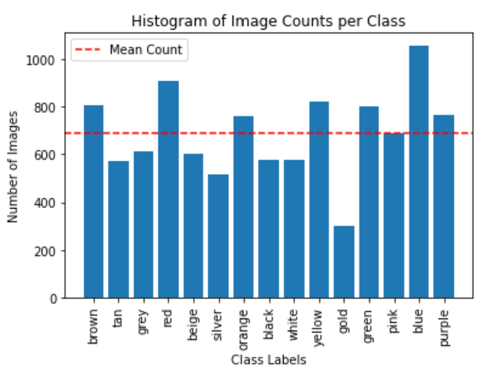
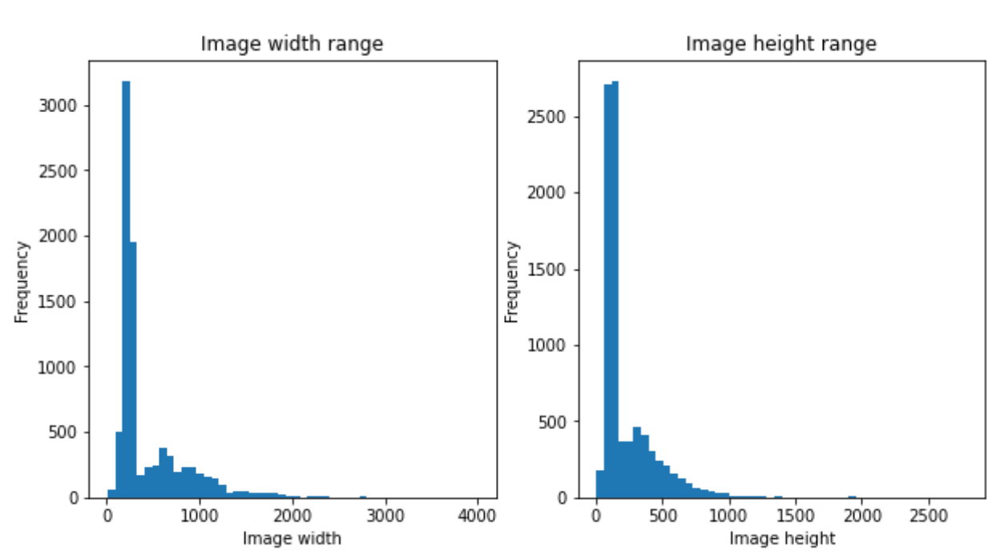
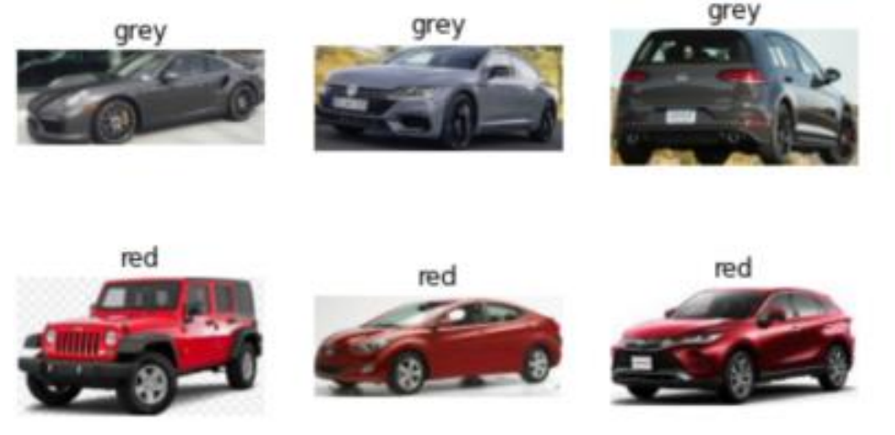
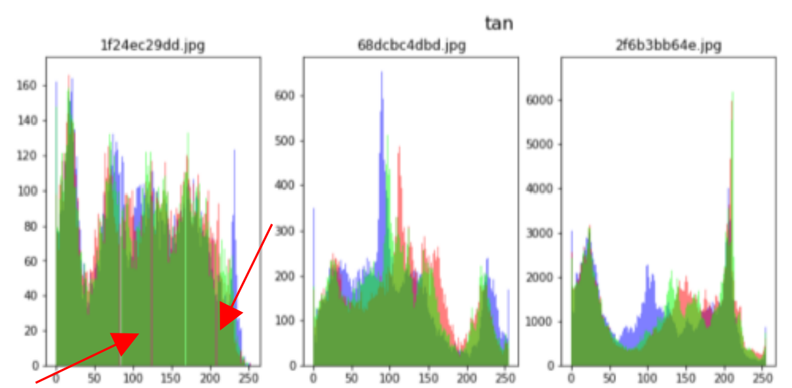
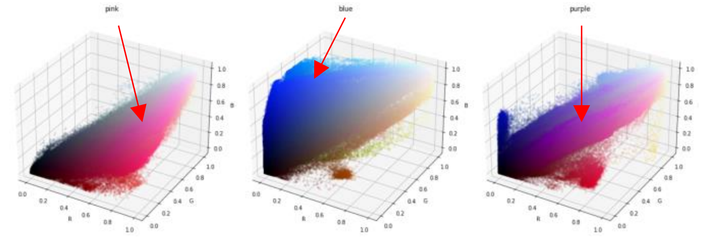
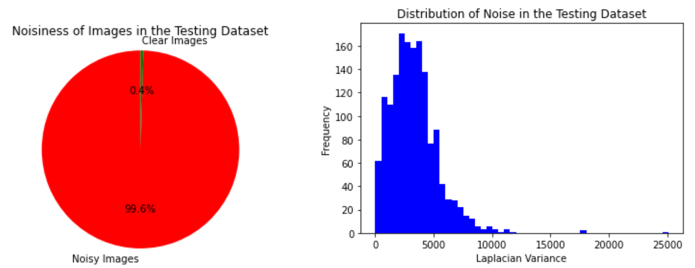
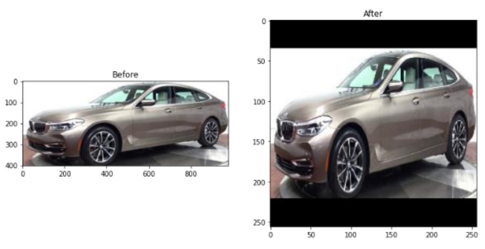
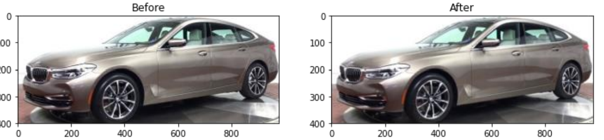
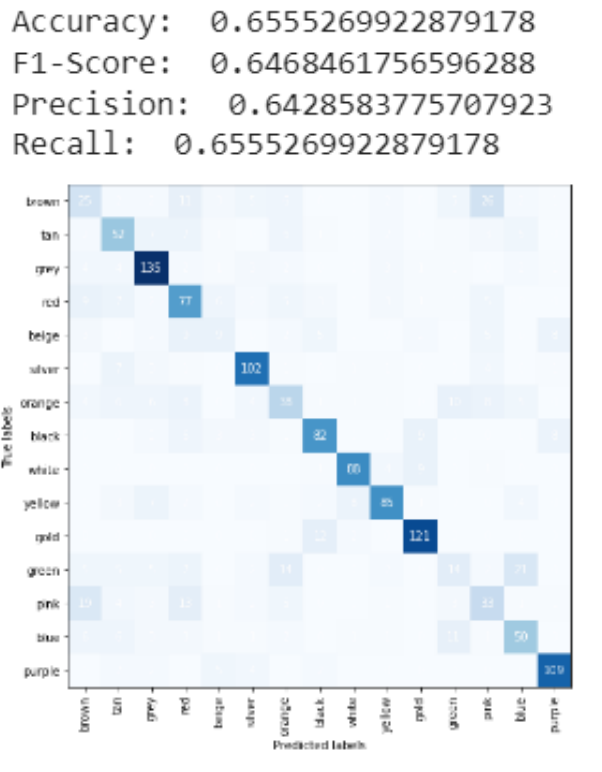

# Abstract
Car theft is a global issue with significant social and economic consequences. Thieves use sophisticated tactics, such as number plate swapping and changing vehicle colour, which make it challenging for law enforcement to recover stolen vehicles. This report proposes using advanced technology, specifically a custom car colour classification model, to combat car theft. The model uses computer vision and machine learning to analyse vehicle images, identify their current colour, and compare it to the registered colour from motor agency databases. By incorporating this model, law enforcement can better identify stolen vehicles, address colour changes, and promote compliance with vehicle registration laws. The report provides a comprehensive overview of the issue and demonstrates the efficacy of the custom car colour classification model using Python code snippets and figures. The results suggest that the model can accurately classify car colours, even when the colour has been changed, to avoid detection. The report concludes with recommendations for implementing the custom car colour classification model and future work to improve its accuracy and usability.
# Background and problem to be addressed
Car theft is a global issue with substantial social and economic consequences. Thieves use sophisticated tactics, such as number plate swapping and changing vehicle colour, complicating law enforcement efforts [\[1\]\[2\].](#_bookmark22) These thefts result in financial losses for owners and insurers, affect public safety, and strain resources [\[3\].](#_bookmark22) The National Insurance Crime Bureau highlights the significance of number plate swapping in car theft [\[4\].](#_bookmark22) Changing a car's colour is another tactic to avoid detection [\[5\].](#_bookmark22) Farrell, Tseloni, and Pease's study demonstrate the impact of colour change on vehicle recovery. To address this, law enforcement must develop effective strategies and techniques.

Advanced technologies like Optical Character Recognition (OCR) and computer vision can combat car theft. OCR tools, such as EasyOCR, and motor agency APIs, such as DVLA's, can provide vehicle information like registered colour. A custom car colour detection model using computer vision and machine learning can analyse vehicle images, identify their current colour, and compare it to the registered colour from motor agency databases. The system may flag the vehicle for potential theft or alteration if discrepancies are detected.

By incorporating OCR-based plate scanning and a custom car colour detection model, law enforcement can better identify stolen vehicles, address number plate swapping and colour changes, deter thieves and promote compliance with vehicle registration laws.
# Exploratory data analysis
Exploratory data analysis (EDA) plays a crucial role in data analysis by providing valuable insights, identifying patterns, and facilitating a deeper understanding of a dataset's underlying structure. In the case of the VCoR dataset, which is designed for advanced vehicle colour recognition research and live traffic video localisation, EDA can be particularly significant.

The VCoR dataset is a large-scale collection of over 10,000 images and 15 colour classes, representing the most popular vehicle colour models as identified by CarMax. The dataset consists of a training folder with 15 subfolders for each of the 15 colour classes, containing approximately 7.5k images, a val folder with 15 subfolders and approximately 1.5k images, and a test folder with 15 subfolders and approximately 1.5k images. All images in the dataset were sourced from Google by LANDRY KEZEBOU, the dataset owner on Kaggle [\[7\].](#_bookmark22)

As a result, EDA plays a vital role in ensuring image dataset quality, balance, and accuracy, leading to improved machine learning performance and more meaningful insights. Finally, it is essential to note that the VCoR dataset is freely available for research and education.
## Checking labels, image split and checking image count per class
Knowing the number of images and labels in each dataset is essential because it provides a basic understanding of the amount and organisation of available data. In addition, knowing the number of images and labels in each dataset can help to check whether the data is appropriately balanced [\[8\].](#_bookmark22)

In this instance, the testing set comprises 14.81% of the data, the training set comprises 69.16%, and the validation set comprises 14.73%. This split allows the model to train on a significant amount of data while being tested on a representative sample of unseen data to provide a more accurate estimate of its performance.

The histogram of class image count reveals that the dataset is poorly distributed. The gold class has only half the number of images compared to every other class, while the blue class has quadrupled the number of images per class than the gold class. We have a few options: discard the gold class as it deviates significantly from the mean count line, use data augmentation, or balance the dataset. However, data augmentation may not be the best choice since we are concerned about accurately detecting the car's colour, which could lead to data anomalies.

## Checking image width and height frequency
Ensuring consistent image sizes in a dataset is crucial for machine learning models, as they necessitate standardised input data, including size and aspect ratio. The inconsistency of image sizes may negatively impact the model's performance during training and prediction.

The code extracts unique image sizes from each dataset (training, validation, and testing) and generates frequency distribution plots for image heights and widths. The plots reveal a skewed distribution in the dataset for both dimensions, with a more pronounced distribution on the left side rather than the centre. Image widths span from 100 to 400 pixels, while heights range from 50 to 150 pixels. This analysis indicates the presence of low-resolution images in the dataset, which are generally suitable for models employing a size of 255x255. However, the primary concern lies in the extensive variety of image sizes. Consequently, it is necessary to scale the images up or down and apply padding to preserve the original aspect ratio.

## Dataset image sampling
Ensuring the quality of the dataset is essential. One way to conduct EDA on image datasets is to sample images from the dataset and plot them to understand the dataset better. Sampling images means randomly selecting a subset of images from the dataset.

Upon examining the sampled images, it became evident that they are closely cropped around the car's edges. It is advantageous as any extraneous background has been effectively eliminated, reducing noise in the dataset. Additionally, the dataset contains various shades of the same colour, which helps the model learn a broader range of colours, ultimately improving its predictive capabilities.

## Image colour frequency

Colour histograms are crucial in various image processing and computer vision tasks. They visually represent the frequency of each colour within an image, enabling a comprehensive understanding of its colour composition. Analysing colour histograms can reveal necessary information about the dataset, such as dominant colours, the range of colours, and the balance of colours across different channels, like red, green, and blue.

The quality and consistency of a dataset can be assessed by examining the colour histograms for multiple images within the dataset. This process helps identify potential issues, including poor colour balance, insufficient colour diversity, or overexposure, which could adversely impact the performance of machine learning models trained on the dataset.

Upon inspecting the plots, it was observed that some histograms had missing bins, indicating that data is absent for specific colour values. This could be attributed to the presence of noise in the images, which may affect their colour distributions and, subsequently, the histogram representation.

## All classes images colour distribution
This approach is similar to the previously discussed colour histogram analysis. However, instead of examining individual colour channels' frequency separately, it visualises the relationship between the three channels (R, G, and B) in a 3D space.

This method allows for investigating the colour noise of other colours more effectively than a simple histogram analysis. By examining the distribution of colours in the 3D space, one can observe the presence of colour noise, which may manifest as scattered points away from the primary colour clusters. This approach helps identify potential issues with image quality that affect the performance of a computer vision or machine learning model.

Upon inspection, it was observed that the expected colours were present, such as pink in the pink plot, blue in the blue plot, and purple in the purple plot. However, an issue arose due to additional colour shades, such as brown occupying a significant area in the blue plot. This is problematic as it suggests that the

model might confuse blue and brown colours, potentially affecting its performance in distinguishing between different colour classes.

## Noise frequency in the dataset
In this section, an analysis is performed to detect noisy images in a dataset by computing each image's Laplacian variance. The Laplacian measures the second-order derivatives of an image, and its variance can be used as an indicator of image noise. A high Laplacian variance typically signifies a noisy image, while a low variance indicates a clear image.

The main goal of this analysis is to assess the quality of the images in the dataset and identify potentially noisy images that might affect the performance of a computer vision or machine learning model. Images are classified as either noisy or clear by defining a threshold for the Laplacian variance [\[9\].](#_bookmark22)

The pie chart indicates that a significant majority of the images in the dataset, 99.6%, are classified as noisy, while only 0.4% are considered clear. This suggests that the dataset may have substantial quality issues, which could negatively impact the performance of computer vision or machine learning models trained on this data. In light of these findings, it is essential to address the noise issue before using the dataset for further analysis or model training.

# Data pre-processing and feature selection
Feature selection and pre-processing are vital in machine learning, involving data cleaning, resizing, normalization, augmentation, and noise reduction for high-quality input. Feature extraction techniques transform raw images into meaningful representations. Proper pre-processing and feature selection enhance performance, speed, interpretability, and resource efficiency while reducing overfitting.

## Dataset image resizing and padding
The method effectively tackles the primary concern of varying image sizes within the dataset by scaling images up or down while applying padding to maintain the original aspect ratio. This pre-processing step standardises the input data and minimises potential adverse effects on the model's performance. Consequently, this approach streamlines the image size normalisation process.

During the pre-processing step, all images are resized to a fixed size (244x244 pixels) while maintaining their original aspect ratios to mitigate inconsistencies in image sizes in the dataset. In order to maintain the proportions of the images, padding has been used to maintain the proportions of the images. This approach aims to ensure that the machine learning model, during both training and prediction, receives standardised input data, which is crucial to ensuring the optimal performance of the model.|

## Denoise images

An image pre-processing pipeline was implemented to address the noise issue in the dataset, which calculates the Signal-to-Noise Ratio (SNR) and applies a median filter to images with an SNR within a specified range. This approach is essential as it helps improve the image quality in the dataset, leading to better performance for computer vision or machine learning models trained on this data.

The SNR calculation helps in identifying noisy images in the dataset. The median filter is then applied to those noisy images to reduce the noise while preserving significant details. This pre-processing pipeline iterates through each image in the dataset and replaces the original noisy image with a filtered one [\[10\].](#_bookmark22)
The overall quality of the dataset has been improved by pre-processing the images in the dataset and reducing their noise. This is crucial for mitigating the quality issues found in the initial analysis. It also ensures that the dataset is more suitable for training and evaluating computer vision or machine learning models.

## Feature extraction for SVM machine learning model
Feature extraction was used to pre-process images and extract colour features to train a Support Vector Machine (SVM) classifier. It is important to note that these features are normalized histograms in the HSV colour space (Hue, Saturation, Value). Since they effectively capture the colour distribution within an image, they are helpful for various image classification tasks. By choosing the HSV colour space, colour information, which is the hue, is separated from brightness (value) and colourfulness (saturation) more efficiently than the traditional RGB/BGR colour space. As a result, the separation results in a more robust representation and can improve performance in image classification tasks.

The image feature extraction process involves several steps. First, the image is read using OpenCV and resized to ensure consistent dimensions. It is then converted from BGR to HSV colour space. Next, histograms are computed for each HSV channel and combined into a single feature vector. This vector is normalized to a range of [0, 1] for consistent scaling, which enhances SVM classifier performance.

Finally, the normalized histogram is flattened into a 1D array and returned as the output [\[11\].](#_bookmark22)

Feature extraction is crucial for training the SVM classifier, as it provides a compact and informative representation of the image's colour distribution. As a result of this information, the classifier can learn patterns and make accurate predictions about the class labels of the input images.

# Machine learning modes
In artificial intelligence, deep learning and machine learning focus on creating algorithms and models for computer learning. Machine learning uses techniques like decision trees, linear regressions, and support vector machines for pattern identification. Deep learning utilizes deep neural networks, excelling in image recognition and natural language processing [\[12\].](#_bookmark22)

Training both models on the same dataset allows for performance comparison, model combination for better results, enhanced feature learning, and understanding of each approach's strengths and limitations [\[13\].](#_bookmark22)

## Machine learning model
Support Vector Machines (SVM) is a robust supervised machine learning algorithm for classification and regression tasks [\[14\].](#_bookmark22) It aims to identify the optimal hyperplane that separates data points from different classes with the most significant margin, ensuring better generalization and preventing overfitting [\[15\].](#_bookmark22)

In this project, SVM was chosen for classifying car images by colour due to its ability to handle high-dimensional data, a characteristic of image datasets. Features were extracted by calculating histograms for the H, S, and V channels and concatenating them into a single feature vector. SVM efficiently processes this high-dimensional feature space [\[15\].](#_bookmark22)

Built-in regularization, controlled by the hyperparameter C, helps prevent overfitting in SVMs. Regularization allows better generalization of unseen data by penalizing complex decision boundaries [\[15\].](#_bookmark22)

SVMs can handle linear and non-linear classification problems by using different kernel functions [\[16\].](#_bookmark22) This project used a linear kernel for its computational efficiency and interpretability. A non-linear kernel, such as the radial basis function (RBF), could have been used to capture more complex patterns.

### Model training and evaluation
This section examines the training and evaluation of an SVM classifier based on the car colour image dataset. It is discussed why the model's parameters were selected and how they were chosen.

In order to achieve optimal performance, several parameters can be adjusted within the SVM classifier. The following parameters were chosen for this project: a linear kernel, a regularization parameter C of 1, and the ability to calculate probabilities. The linear kernel was chosen for its simplicity and interpretability. Linear kernels are computationally efficient and straightforward to interpret compared to non- linear kernels, such as the RBF kernel. They also offer better interpretability, as linear models have fewer parameters and more precise decision boundaries.

The regularization parameter C controls the trade-off between achieving a large margin and minimizing classification errors. C was set to 1, representing a balance between maximizing the margin and minimizing classification errors, helping prevent overfitting and improving generalization performance on unseen data.

By setting the probability parameter to True, the classifier can output probability estimates for each class, which may be helpful when determining the confidence level associated with the model's predictions. The probability parameter was set to True in this project to provide flexibility for further analysis or decision-making processes.

### Results and discussion
The model's performance can be evaluated using several standard metrics, including accuracy, F1-score, precision, and recall. These metrics provide valuable insights into the model's effectiveness in classifying instances in a dataset. This study used various evaluation metrics to assess the car colour classification model's performance.

The accuracy, representing the proportion of correct predictions out of the total predictions, was approximately 65.55%. This result indicates that the model classified the car colours correctly in 65.55% of the cases.

The F1-Score, which combines precision and recall by calculating their harmonic mean, was determined to be 0.6468. This value suggests that the model exhibits moderate performance in terms of both precision and recall. Precision, defined as the ratio of true positive predictions to all positive predictions, was approximately 64.29%. This metric implies that when the model predicted a specific car colour, it was accurate 64.29% of the time.

Recall, also known as sensitivity, measures the proportion of true positive predictions relative to the total number of positive instances. The model achieved a recall of approximately 65.55%, indicating that it correctly identified 65.55% of the cars with the right colour out of all cars with that colour in the dataset.

The confusion matrix indicates that the model performs well. In a confusion matrix, rows correspond to true labels, while columns represent predicted labels. A high-performing model typically exhibits high values along the diagonal and low values elsewhere, signalling many correct predictions and few incorrect ones.

The diagonal values of the confusion matrix, which represent correct predictions, are substantially higher than the other values in the same row or column. It demonstrates the model's accuracy in predicting car colours.

For instance, consider the 'grey' row. The highest value in this row is 135, signifying that the model correctly predicted 'grey' 135 times. However, some non-diagonal colours, such as beige, indicate that the model is more accurate in predicting dark colours than light ones. These discrepancies may contribute to the lower

performance observed in the previously discussed metrics.

## Deep learning model

The Convolutional Neural Network (CNN) was employed in this study for car colour classification from images. CNNs have proven effective in image classification tasks because they can learn spatial hierarchies in data. They comprise multiple layers, including convolutional, pooling, and fully connected layers, which detect and extract relevant features from input images [\[17\].](#_bookmark22)

Compared with other deep learning models, CNNs have advantages over recurrent neural networks (RNNs) and multilayer perceptron’s (MLPs). It was designed specifically for image processing and excelled at leveraging the spatial structure of the input data. Moreover, it is more computationally efficient when dealing with high-dimensional inputs, as it uses shared weights and local operations to reduce the number of learnable parameters. Given these advantages and the demonstrated success of CNNs in similar tasks, a CNN was chosen for the car colour classification problem [\[18\].](#_bookmark22)

### Model training and evaluation
There are several layers in the CNN model designed to process and learn from the image dataset effectively. These layers include convolutional layers, pooling layers, and fully connected layers. Several factors have been considered when selecting the layer parameters, including the need to capture spatial information from the images of the cars and the need to learn complex patterns that will assist in classifying the cars' colours.

The first convolutional layer is designed to capture essential spatial features in the input images, using a specific number of filters, filter size, and stride. These parameters detect low-level features, such as edges and corners, which can help distinguish different car colours. The first convolutional layer employs 32 filters of size 3x3, ReLU activation, and the same padding in the model. The input shape is set as (244, 244, 3) for 244x244 pixel RGB images. The selected parameters contribute to the car colour classification task by detecting low-level features in the input images. The ReLU activation function introduces non-linearity into the model, enabling it to learn complex patterns in the data. This function is favoured for its computational efficiency and ability to mitigate the vanishing gradient problem that can arise during backpropagation.

After the first convolutional layer, a max-pooling layer with a pool size of 2x2 is incorporated to reduce the spatial dimensions of the feature maps, making the model more robust to slight input data variations. A dropout layer with a 20% dropout rate is also added to prevent overfitting and enhance the model's generalisation capabilities.

The second convolutional layer aims to capture more abstract spatial features in the input images. Another ReLU activation function and max-pooling layer follow it. This layer in the model consists of 64 filters of size 3x3 with ReLU activation and the same padding. This configuration enables the model to learn more complex patterns and higher-level features, such as car shapes and contours, contributing to the car colour classification task. The increase in filters from the previous layer allows the model to learn more intricate patterns.

After the second convolutional layer, another max-pooling layer with a pool size of 2x2 is introduced further to reduce the spatial dimensions of the feature maps, enhancing the model's robustness to slight variations in input data. An additional dropout layer with a 20% dropout rate is included to prevent overfitting and improve generalisation.

A flattened layer follows, converting the 2D feature maps into a 1D vector, input for the fully connected layers. The first dense layer performs classification based on the features extracted from the previous layers, with the number of neurons chosen to balance the model's expressiveness and the risk of overfitting. The final output layer employs the softmax activation function to produce probability scores for each class, enabling car colour prediction.

The remaining layers, including the third convolutional and fully connected layers, build upon the features learned in the first and second convolutional layers to perform the car colour classification task.

The observed difference between the training and validation accuracy implies some overfitting, further supported by the cross-entropy loss plot. This plot reveals that the intersection between training and validation loss occurs around 20 epochs, after which the validation loss begins to plateau while the training loss continues to decrease. These observations suggest the optimal number of epochs might be closer to 20. However, due to time constraints, the model was not retrained with fewer epochs.

### Results and discussion
These metrics provide valuable insights into the model's effectiveness in classifying instances in a dataset.

Accuracy represents the ratio of correctly classified instances to the total instances in the dataset. In this case, the accuracy is approximately 7.52% (0.07519). This low accuracy suggests that the model is not effectively classifying car colours, as it only correctly predicts about 7.52% of test instances.

The F1-score is the harmonic mean of precision and recall, offering a single metric that balances both aspects. The F1-score in this instance is around 7.53% (0.0753). A low F1-score like this indicates the model is struggling to balance precision and recall, signifying poor performance. Precision measures the ratio of true positives to the sum of true and false positives. In this case, the precision is approximately 7.61% (0.07609).

This value indicates that out of all instances predicted as a specific colour, only 7.61% were that colour. Low precision suggests that the model has a high rate of false positives. Recall, also known as sensitivity, calculates the ratio of true positives to the sum of true positives and false negatives. In this case, the recall is around 7.52% (0.07519). It means that out of all instances with a specific colour, only 7.52% were correctly predicted as that colour. A low recall implies a high rate of false negatives.

The confusion matrix suggests that the model did not perform well. In a confusion matrix, the rows represent the true labels, and the columns represent the predicted labels. A well-performing model would have high values along the diagonal and low values elsewhere, indicating a high number of correct predictions and few incorrect ones.

In the confusion matrix, the diagonal values representing the correct predictions are not significantly higher than the other values in the same row or column. It indicates that the model is not accurately predicting the car colours.

For example, let us look at the 'blue' row. The highest value in this row is 20, meaning the model correctly predicted 'blue' 20 times. However, the other values in the same row are relatively high, such as 17 for 'green' and 18 for 'silver'. It means the model frequently misclassified 'blue' cars as 'green' or 'silver'.

Similar patterns can be observed for other colours, demonstrating that the model struggles to predict car colours accurately. It is in line with the low-performance metrics discussed earlier.

To improve the model's performance, might need to consider addressing issues such as overfitting, increasing the amount of training data, or adjusting the model architecture.

### Results comparison across the models built
The comparison of the results indicates that the SVM model significantly outperforms the CNN model in car colour classification. The SVM model achieved an accuracy of 65.55%, while the CNN model only reached 7.52%. The other metrics, such as F1-score, precision, and recall, also demonstrate the SVM model's superior performance over the CNN model.

There could be several reasons why the SVM model performed better than the CNN model in this case. One reason is model suitability; SVMs are known for handling high-dimensional data and performing well on various classification tasks. The SVM model might be more suitable for the car colour classification problem, given the specific dataset and feature representation.

Another factor could be model complexity. The CNN model's architecture might not be optimal for the car colour classification task. CNNs are potent models for image classification tasks, but their performance depends on the choice of layers, filters, and activation functions. An inappropriate architecture may lead to poor performance.

Overfitting may also play a role in the performance difference. The CNN model may be overfitting the training data, leading to a poor generalisation of the test data. Regularisation techniques, such as dropout, weight decay, or early stopping, could be employed to mitigate overfitting and improve performance.

# Conclusion
In conclusion, the superior performance of the SVM model in the car colour classification task can be attributed to its suitability for the problem, better optimization, and resistance to overfitting. On the other hand, the CNN model's performance could be enhanced by refining the architecture, addressing overfitting, and optimizing hyperparameters. Despite this, I am pleased with the overall results of the model. The task was a learning process, providing a deeper understanding of artificial intelligence.

# References
1. Field, S. (n.d.). *CRIME PREVENTION AND THE COSTS OF AUTO THEFT: AN ECONOMIC ANALYSIS*. [online] Available at:
[https://citeseerx.ist.psu.edu/document?repid=rep1&type=pdf&doi=dd03a9db9e35fdd12af617699f1572c7285580c6.](https://citeseerx.ist.psu.edu/document?repid=rep1&type=pdf&doi=dd03a9db9e35fdd12af617699f1572c7285580c6)

1. Pires, S.F., Schneider, J.L. and Herrera, M. (2015). Organized crime or crime that is organized? The parrot trade in the neotropics. *Trends in Organized Crime*, 19(1), pp.4–20.

1. Felson, M. and Clarke, R. (1998). *Opportunity Makes the Thief Practical theory for crime prevention*. [online] Available at: [https://popcenter.asu.edu/sites/default/files/opportunity_makes_the_thief.pdf.](https://popcenter.asu.edu/sites/default/files/opportunity_makes_the_thief.pdf)

1. Become a Problem Solving Crime Analyst In 55 small steps. (n.d.). Available at: [https://popcenter.asu.edu/sites/default/files/library/reading/PDFs/55stepsUK.pdf.](https://popcenter.asu.edu/sites/default/files/library/reading/PDFs/55stepsUK.pdf)

1. Sidebottom, A., Belur, J., Bowers, K., Tompson, L. and Johnson, S.D. (2011). Theft in Price-Volatile Markets. *Journal of Research in Crime and Delinquency*, 48(3), pp.396–418.
1. [www.nicb.org.](http://www.nicb.org/) (n.d.). *Annual Report 2019 | National Insurance Crime Bureau*. [online] Available at: [https://www.nicb.org/annual-](https://www.nicb.org/annual-reports/annual-report-2019) [reports/annual-report-2019](https://www.nicb.org/annual-reports/annual-report-2019)

1. [www.kaggle.com.](http://www.kaggle.com/) (n.d.). *VCoR (Vehicle Color Recognition) Dataset*. [online] Available at: <https://www.kaggle.com/datasets/landrykezebou/vcor-vehicle-color-recognition-dataset>

1. Byeon, E. (2020). *Exploratory Data Analysis Ideas for Image Classification*. [online] Medium. Available at: <https://towardsdatascience.com/exploratory-data-analysis-ideas-for-image-classification-d3fc6bbfb2d2>

1. Stack Overflow. (n.d.). *python - Image noise estimation base on histogram*. [online] Available at: <https://stackoverflow.com/questions/57133157/image-noise-estimation-base-on-histogram>

1. opencv24-python-tutorials.readthedocs.io. (n.d.). *Image Denoising — OpenCV-Python Tutorials beta documentation*. [online] Available at: <https://opencv24-python-tutorials.readthedocs.io/en/latest/py_tutorials/py_photo/py_non_local_means/py_non_local_means.html>

1. Easy, D.D.A.M.S. (2018). *Understanding SVMs’: For Image Classification*. [online] Medium. Available at: [https://medium.com/@dataturks/understanding-svms-for-image-classification-cf4f01232700](https://medium.com/%40dataturks/understanding-svms-for-image-classification-cf4f01232700)

1. Bengio, Y. (2013). Deep Learning of Representations: Looking Forward. *Statistical Language and Speech Processing*, pp.1–37.

1. Goodfellow, I., Bengio, Y. and Courville, A. (2016). *Deep Learning*. [online] Deeplearningbook.org. Available at: <https://www.deeplearningbook.org/>

1. Vladimir Naoumovitch Vapnik (2000). *The nature of statistical learning theory*. New York: Springer, Cop

1. Smola, A.J. and Schölkopf, B. (2004). A tutorial on support vector regression. *Statistics and Computing*, [online] 14(3), pp.199–222. Available at: <https://alex.smola.org/papers/2004/SmoSch04.pdf>

1. Learning with Kernels. (n.d.). Available at: <https://mcube.lab.nycu.edu.tw/~cfung/docs/books/scholkopf2002learning_with_kernels.pdf>

1. Krizhevsky, A., Sutskever, I. and Hinton, G.E. (2012). ImageNet classification with deep convolutional neural networks. *Communications of the ACM*, 60(6), pp.84–90.
  
1. LeCun, Y., Bengio, Y. and Hinton, G. (2015). Deep Learning. *Nature*, [online] 521(7553), pp.436–444. Available at: <https://www.nature.com/articles/nature14539>

